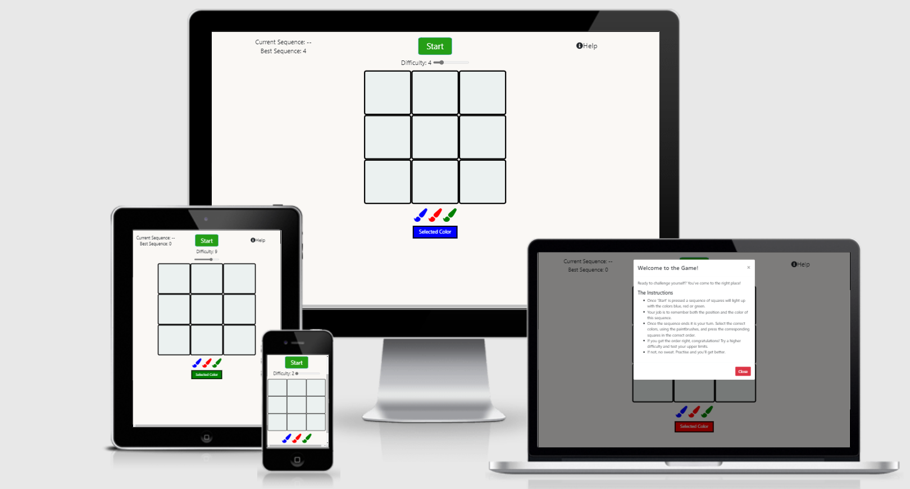

<h1 align="center">Colourful Memory</h1>

[View the live project here.](https://jason-philip.github.io/ColorMemoryGame/)

A sequence and memory testing game that uses a 3x3 grid pattern of squares that light up in random order with a random color.  The user must remember this order and color executing it back using clicks and color selection.  The site will provide a peaceful and focused place for the user to challenge themselves and have fun.

## Code validation

- HTML
    - My HTML files were checked using [W3C validator](https://validator.w3.org/#validate_by_uri) 

    

- CSS
    - My CSS files were checked using [W3C CSS validator](https://jigsaw.w3.org/css-validator/validator) 

    

- JavaScript
    - My JS files were checked using [JS-hint](https://jshint.com/)

    

## User Experience Goals (UX)
    1. The site should be simple to understand and easy to engage with, even without detailed reading of the instructions.
    2. The content should meet the requierement of challenging a range of skill levels with a lower-end of difficulty that all will be able to perform and upper-end that only the best memory can meet.
    3. The atmosphere of the background and interactions should be undistracting and subdued, so that the user can stay focused and concentrate on the game 
    4. The user will want unobtrusive confirmation of how they are performing and what they did right or wrong.
    5. The user should not have to worry about causing a problem in game logic, while using the site.

## Design
-   ### Wireframes
    The wireframes from the initial design stage can be found [wireframes](assets/readme-imgs/wireframes.png)

-   ### Color and Style Selection
    The approach to the style of the site was minimalist so that the user can be fully focused on the challenge.  A off-white color was used for the background to not strain the eye.  For the color flashes primary colors were used to avoid confusion and make clear the pattern.  All buttons are styled to hint at their purpose paintbrush is red, to apply red paint.  The 3x3 pattern was kept as large as possible screensize permitting, while maintaining its distinctive squares.

-   ### Features
    -   #### Modals
    Onload the help modal pop-up triggers so the user can familiarise themselves with the rules (Recommended by user feedback).
    A modal will play in the event of a loss explaining to the user they have failed and what they did wrong using JS.  Two buttons allow the user to chose their next action try-again at same difficulty or close change difficulty.
    On the event of a win the pop-up modal will inform you as such and button offer increase the difficulty or close to change difficulty.
    -   #### Sequence (The Challenge)
    Using the range slider a sensible difficulty can be selected, determining the length of the sequence, this is by default set to 2; the lowest difficulty.  Once start is pressed the pattern will play a random sequence of positions in the 3x3 and colors, with the tiles disabled during this pattern.  Once completed the tiles are re-activated and the user enters their guess.  
    -   ### Paintbrushes
    Color is a big part of the game, under the 3x3 grid the colors can be quickly selected so the user can match their guesses quickly.  A curent color area makes it easy to check what color is selected.
    -   ### Tracking Progress
    On the top left the current round and highest successful sequence are tracked by Js. 

-   ### Future Features 
    In the future other cognitive challenges could be offerred with a central connecting navpage recording scores and enabling easy transition to challenges.  Also for this particulr game a removal of the colors could be added for a different experience and as an option for the colorblind.

## Technologies Used

### Languages Used

1. [HTML5:](https://en.wikipedia.org/wiki/HTML5)
   - HTML5 was used for the sturcture of the webpages.
2. [CSS3:](https://en.wikipedia.org/wiki/Cascading_Style_Sheets)
   - CSS3 was used for the styling and responsive elements.
3. [JavaScript:](https://en.wikipedia.org/wiki/JavaScript)
   - JavaScript was used for the games logic.

### Frameworks, Libraries & Programs Used

1. [Bootstrap 4.5.2](https://getbootstrap.com/)
   - Bootstrap was used for both the creation of the 3x3 challenge area as well as the top of the page with the start/stop button and the help and score areas.
2. [Font Awesome](https://fontawesome.com/)
   - Font Awesome was used adding icons for the info and paintprushes.
4. [jQuery](https://jquery.com/)
   - JQuery was used throughout the website for the interactive features.
5. [Gitpod](https://www.gitpod.io/)
    - Gitpod was used to write the code.
6. [Git](https://git-scm.com/)
    - Git was the version control system used for this project.
7. [GitHub](https://github.com/)
    - GitHub is used to store the project's code and any other required files.
8. [Balsamiq](https://balsamiq.com/)
    - Balsamiq was used to create the wireframes during the design phase of the project.
9. [Ami.responsivedesign](http://ami.responsivedesign.is)
    - Am I responsive site was used as a presentation aid in this readme file.

# Testing
## User stories
### Testing User Stories from User Experience (UX) Section

1. The site should be simple to understand and easy to engage with, even without detailed reading of the instructions.

    - The initial pop-up dispays the instructions so the userknows what the game is about.  
    - The minimalist design allows user to see the main elements of the game, leading to better understanding.
    - Help is available on click so the instructions can be reconsulted.
    - The start/stop button operates the game immediately so the user can learn through trial and error without punishment ingame or through time delay. 
    - When a sequence is not started the user is still allowed to press the buttons for a colorful response allowing them to familiarize themselves with the setup.

2. The content should meet the requierement of challenging a range of skill levels with a lower-end of difficulty that all will be able to perform and upper-end that only the best memory can meet.

    - The difficulty slider allows for interactive selection of difficulty ranging from sequences of two (easy) to twelve(near impossible).  
    - On page load the default difficulty is 2 allowing the user to succeed at these lower difficulty allows for everyone to come away with some sense of accomplishment.  These lower difficulties can also be completed by the most skilled individuals quickly, avoiding any frustration.

3. The atmosphere of the background and interactions should be undistracting and subdued, so that the user can stay focused and concentrate on the game 

    - The site is minimalist with an off-white background allowing for easy viewing and avoiding any clutter that could distract the user from the challenge.

4. The user will want unobtrusive confirmation of how they are performing and what they did right or wrong.

    - The user is informed of win or loss by modal pop-up only when the whole pattern is completed.
    - The loss modal tells the user where they went wrong, with either the color or position or both.
    - The slider updates on sucess so the user can visually see their progress through the levels as the go.
    - The users best score is recorded in text at the top right corner so they know what to beat.

5. The user should not have to worry about causing a problem in game logic, while using the site.

    - The user is not allowed to interfere when the pattern is playing, by accidental click or curiosity.  
    - Testing of all the interactive features before, during and after sequence playing has been performed to ensure no accidental interference.

## User Feedback

    User feedback was given by my Mentor, family and friends they reported the following:
        - Unclear the purpose of the game when initially started, this was remedied by launching the help modal at the start of the game.
        - Prefer to start at a low difficulty (during testing the difficulty was set to 4), the default is now 2.
        - Would like to visually see progess.  In response the slider was updated on each sucessful level-up.

## feature and Logic testing

    -   The two primary places of testing were on developer tools on mozilla firefox and microsoft edge, using the element selector most positioning, margin and padding issues were tested here first.
    -   The Website was tested on Google Chrome, Internet Explorer, and Safari browsers also.
    -   The website was viewed on a variety of devices such as Desktop, Laptop, iPhone7, iPhone 8 & iPhoneX and resized from a large range of sizes in web developer tools to ensure responsive design across the board.
    -   A large amount of testing was done to ensure that all pages were linking correctly.
    -   logs in the console allowed for viewing of arrays and variables in developer tools to ensure the logic was performing correctly.
    -   Friends and family members were asked to review the site and documentation to point out any bugs and/or user experience issues.

# Bug Fixes

# Deployment

## Initial Deployment

1.  Logging into my GitHub account and clickng the green button near the top left of the page displaying the text NEW.
This took me to a page with the option to create a new repository. 
2. Under repository template I clicked on the code institute template. I chose a name for the repository suitable for the project and then clicked the create repository button.
3. I opened the new repository and clciked on the green gitpod button to open the workspace for writing and editing my code to develop the site.
## GitHub Pages

The project was deployed to GitHub Pages using the following steps:

1.  Logged in to GitHub and clicked on the relelavant [GitHub Repository](https://github.com/Jason-Philip/ColorMemoryGame).
2.  Found "Settings" button at the top of the repository.
3.  Scrolled down to the "Pages" section.
4.  In the source dropdown menu select "master".
5.  saved and refreshed.
6.  A message appeared giving a link to the launched site.

## Forking the GitHub repository

If the GitHub Repository needs forked use the following:

1.  In GitHub locate the correct repository.
2.  At the top-right among the three buttons, click the "Fork" Button which is the furthest right.
3.  A copy of the original repository will now be in your account.

More information about forking a GitHub repository is [here](https://docs.github.com/en/github/getting-started-with-github/fork-a-repo).

## Making a Local Clone

For creating a local clone of the repository, do the following:

1.  Log in to GitHub and locate the project's [GitHub Repository](https://github.com/Jason-Philip/ColorMemoryGame).
2.  Under the repository name, find and click the "Code" button this will bring up a drop-down area.
3.  To clone the repository using HTTPS, under "Clone with HTTPS", click the clipboard button to copy the repository URL.
    To clone using SSH click "Use SSH" and then click the clipboard button.
4.  Open Git Bash
5.  Change the current working directory to the location where you want to store the cloned repository.
6.  Type `git clone` and then paste the URL you copied in Step 3.

3.  Alternatively a zip can be downloaded and extracted and saved locally.

More information about making a local clone of a GitHub repository is [here](https://docs.github.com/en/github/creating-cloning-and-archiving-repositories/cloning-a-repository).

# Credits

### Code

-   The README.md is based off a template from code Institute.

-   [Bootstrap4](https://getbootstrap.com/docs/4.4/getting-started/introduction/): Bootstrap Library used throughout the project mainly to make site responsive using the Bootstrap Grid System.

-   [W3schools](https://www.w3schools.com/) : Was used in part to create the modal using JavaScript.  Tutorial Found [Here](https://www.w3schools.com/howto/howto_css_modals.asp#:~:text=%20How%20To%20Create%20a%20Modal%20Box%20,fixed%3B%207%20Step%203%29%20Add%20JavaScript%3A%20More%20)

- [Slack](https://slack.com/intl/en-gb/) : 

    - The community on slack was greatly helpful with the development ideas and answering coding related questions as well as demonstrating how to properly structure the writing of the code and the ReadMe.

### Content

-   Inspiration for the idea came from [Human Benchmark](https://humanbenchmark.com/), who have many iteresting challenges and cognitive tests. 

### Acknowledgements

-   My Mentor for helpful feedback.

-   Tutor support at Code Institute for their support.

-   Student care for keeping in touch about deadlines.

-   Family and friends for user feedback.